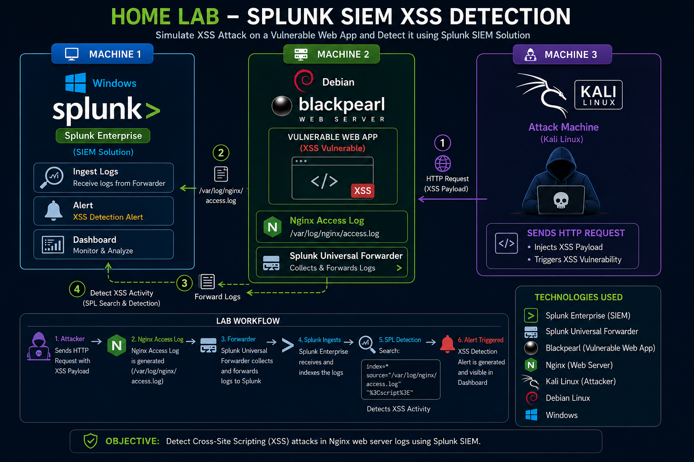
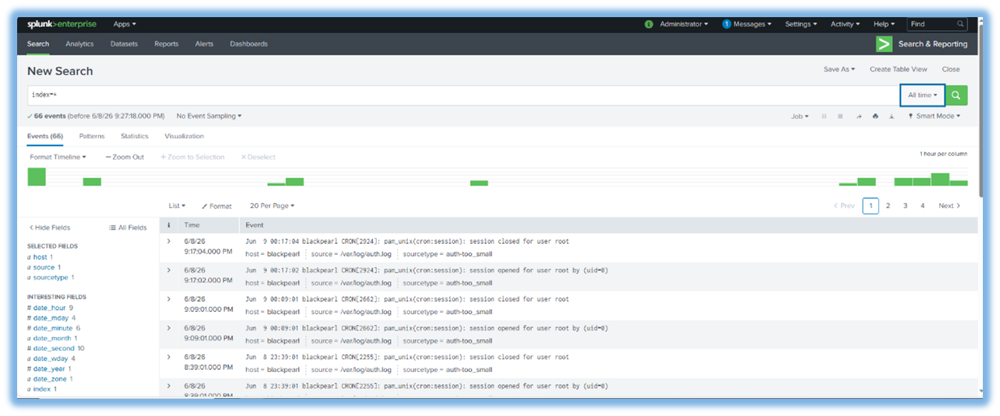

<div align="center">

# 🛡️ Splunk XSS Detection Lab

### End-to-End SOC Project for Detecting Cross-Site Scripting (XSS) Attacks using Splunk Enterprise

<p>


</p>

[🎥 Watch Demo](https://youtu.be/-MvQjQNHAwM) •
[📄 Documentation](Documentation/Splunk-XSS-Detection-Lab%20-28%20June%202026.pdf)

</div>

---
# 📖 Project Overview

This project demonstrates an end-to-end Security Operations Center (SOC) workflow for detecting Cross-Site Scripting (XSS) attacks using Splunk Enterprise.

A realistic attack was simulated from Kali Linux against a vulnerable BlackPearl web application. The generated Nginx logs were collected using Splunk Universal Forwarder, analyzed with SPL queries, and transformed into actionable security alerts for investigation.

---
## ⭐ Project Highlights

- Built a complete SOC lab environment
- Simulated a real XSS attack
- Centralized Nginx log collection
- Developed custom SPL detection queries
- Configured real-time security alerts
- Performed incident investigation
- Produced complete technical documentation

---
## 🏗️ Lab Architecture

<p align="center">



</p>


---
## 🖥️ Lab Environment

| Machine | Operating System | Role |
|---------|------------------|------|
| Splunk Enterprise | Windows Server | SIEM Platform |
| BlackPearl | Debian Linux | Vulnerable Web Server |
| Kali Linux | Kali Linux | Attacker Machine |

---

## 🔄 Attack Workflow

```text
Kali Linux
      │
      ▼
BlackPearl Web Server
      │
      ▼
Nginx Access Logs
      │
      ▼
Splunk Universal Forwarder
      │
      ▼
Splunk Enterprise
      │
      ▼
SPL Detection
      │
      ▼
Real-Time Alert
      │
      ▼
SOC Analyst Investigation
```
---

## 📸 Project Screenshots

### Architecture


---

### Splunk Login


---

### Search Results



---

### XSS Detection Alert


---

### Triggered Alerts


---

## ⚙️ Technologies Used

- Splunk Enterprise
- Splunk Universal Forwarder
- Kali Linux
- Search Processing Language (SPL)
- SIEM

---

## 💡 Skills Demonstrated

- SIEM Deployment
- Security Monitoring
- Log Analysis
- SPL Query Development
- Alert Configuration
- Incident Investigation
- Linux Administration
- Windows Administration
- SOC Workflow
- XSS Detection

---
## 📄 Documentation

📥 Download the complete project documentation here:

➡️ **[📄 Splunk XSS Detection Lab Documentation](Documentation/Splunk-XSS-Detection-Lab%20-28%20June%202026.pdf)**

---
## 🎥 Video Demonstration

📺 Watch the complete project demonstration:

[](https://youtu.be/-MvQjQNHAwM)

---

## 🚀 Future Improvements

- SQL Injection Detection
- Brute Force Detection
- Correlation Searches
- Interactive Dashboards
- Email Alerting
- Threat Intelligence Integration
  
---

<div align="center">

## 👩‍💻 Author

# Shaymaa Hisham

Cybersecurity Enthusiast | SOC Analyst | SIEM | Splunk

⭐ If you found this project useful, don't forget to star the repository.

</div>

